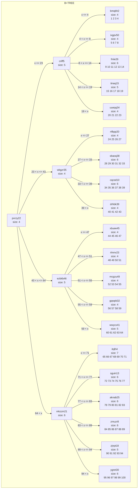

```mermaid
graph TD
subgraph B+TREE
pvrzy22[pvrzy22<br/>size: 4<br/>]
criff5[criff5<br/>size: 5<br/>]
bmqbh2[bmqbh2<br/>size: 4<br/>1 2 3 4 ]
criff5-->|x <= 4|bmqbh2
ixgpv50[ixgpv50<br/>size: 4<br/>5 6 7 8 ]
criff5-->|4 < x <= 8|ixgpv50
fniie26[fniie26<br/>size: 6<br/>9 10 11 12 13 14 ]
criff5-->|8 < x <= 14|fniie26
tinaq15[tinaq15<br/>size: 5<br/>15 16 17 18 19 ]
criff5-->|14 < x <= 19|tinaq15
uueqq34[uueqq34<br/>size: 4<br/>20 21 22 23 ]
criff5-->|19 < x|uueqq34
pvrzy22-->|x <= 23|criff5
wkgzr35[wkgzr35<br/>size: 4<br/>]
nfbpp20[nfbpp20<br/>size: 4<br/>24 25 26 27 ]
wkgzr35-->|x <= 27|nfbpp20
sbaoq38[sbaoq38<br/>size: 6<br/>28 29 30 31 32 33 ]
wkgzr35-->|27 < x <= 33|sbaoq38
cqcsd10[cqcsd10<br/>size: 6<br/>34 35 36 37 38 39 ]
wkgzr35-->|33 < x <= 39|cqcsd10
drhbk39[drhbk39<br/>size: 4<br/>40 41 42 43 ]
wkgzr35-->|39 < x|drhbk39
pvrzy22-->|23 < x <= 43|wkgzr35
ezbkb46[ezbkb46<br/>size: 5<br/>]
xbuee45[xbuee45<br/>size: 4<br/>44 45 46 47 ]
ezbkb46-->|x <= 47|xbuee45
rlmnv23[rlmnv23<br/>size: 4<br/>48 49 50 51 ]
ezbkb46-->|47 < x <= 51|rlmnv23
mcgzu49[mcgzu49<br/>size: 4<br/>52 53 54 55 ]
ezbkb46-->|51 < x <= 55|mcgzu49
gqwpb32[gqwpb32<br/>size: 4<br/>56 57 58 59 ]
ezbkb46-->|55 < x <= 59|gqwpb32
wwycx41[wwycx41<br/>size: 5<br/>60 61 62 63 64 ]
ezbkb46-->|59 < x|wwycx41
pvrzy22-->|43 < x <= 64|ezbkb46
mkzzm21[mkzzm21<br/>size: 6<br/>]
itqlh4[itqlh4<br/>size: 7<br/>65 66 67 68 69 70 71 ]
mkzzm21-->|x <= 71|itqlh4
sguin13[sguin13<br/>size: 6<br/>72 73 74 75 76 77 ]
mkzzm21-->|71 < x <= 77|sguin13
aknab25[aknab25<br/>size: 6<br/>78 79 80 81 82 83 ]
mkzzm21-->|77 < x <= 83|aknab25
zmuzr8[zmuzr8<br/>size: 6<br/>84 85 86 87 88 89 ]
mkzzm21-->|83 < x <= 89|zmuzr8
zjnpt18[zjnpt18<br/>size: 5<br/>90 91 92 93 94 ]
mkzzm21-->|89 < x <= 94|zjnpt18
ygret30[ygret30<br/>size: 6<br/>95 96 97 98 99 100 ]
mkzzm21-->|94 < x|ygret30
pvrzy22-->|64 < x|mkzzm21
end
```

```mermaid
graph LR
subgraph UNORDERED_HEAP
nwlrb1[nwlrb1<br/>size: 4<br/>23 86 17 52 ]
cohfv3[cohfv3<br/>size: 4<br/>85 83 69 64 ]
nwlrb1-->cohfv3
ekgdd6[ekgdd6<br/>size: 4<br/>33 91 84 1 ]
cohfv3-->ekgdd6
wnqhr7[wnqhr7<br/>size: 4<br/>71 75 47 77 ]
ekgdd6-->wnqhr7
yehhj9[yehhj9<br/>size: 4<br/>46 94 68 11 ]
wnqhr7-->yehhj9
mwuwd11[mwuwd11<br/>size: 4<br/>35 99 60 9 ]
yehhj9-->mwuwd11
zcnif12[zcnif12<br/>size: 4<br/>70 89 14 80 ]
mwuwd11-->zcnif12
njzij14[njzij14<br/>size: 4<br/>67 18 12 38 ]
zcnif12-->njzij14
wfiaz16[wfiaz16<br/>size: 4<br/>31 28 82 7 ]
njzij14-->wfiaz16
lowil17[lowil17<br/>size: 4<br/>76 6 81 93 ]
wfiaz16-->lowil17
vhars19[vhars19<br/>size: 4<br/>90 21 29 53 ]
lowil17-->vhars19
xoend24[xoend24<br/>size: 4<br/>73 8 4 54 ]
vhars19-->xoend24
xvozw27[xvozw27<br/>size: 4<br/>97 19 59 87 ]
xoend24-->xvozw27
dquuq28[dquuq28<br/>size: 4<br/>72 3 58 98 ]
xvozw27-->dquuq28
sndgc29[sndgc29<br/>size: 4<br/>41 95 20 39 ]
dquuq28-->sndgc29
wedjg31[wedjg31<br/>size: 4<br/>55 66 5 15 ]
sndgc29-->wedjg31
aoyrn33[aoyrn33<br/>size: 4<br/>26 22 25 61 ]
wedjg31-->aoyrn33
izxzf36[izxzf36<br/>size: 4<br/>65 43 24 62 ]
aoyrn33-->izxzf36
qymvj37[qymvj37<br/>size: 4<br/>56 27 36 40 ]
izxzf36-->qymvj37
uxeao40[uxeao40<br/>size: 4<br/>30 13 79 57 ]
qymvj37-->uxeao40
rlyom42[rlyom42<br/>size: 4<br/>37 96 74 78 ]
uxeao40-->rlyom42
egmsb43[egmsb43<br/>size: 4<br/>16 44 48 34 ]
rlyom42-->egmsb43
wmfyb44[wmfyb44<br/>size: 4<br/>42 49 92 45 ]
egmsb43-->wmfyb44
riysl47[riysl47<br/>size: 4<br/>32 50 63 10 ]
wmfyb44-->riysl47
xjywy48[xjywy48<br/>size: 4<br/>88 100 51 2 ]
riysl47-->xjywy48
end
```
